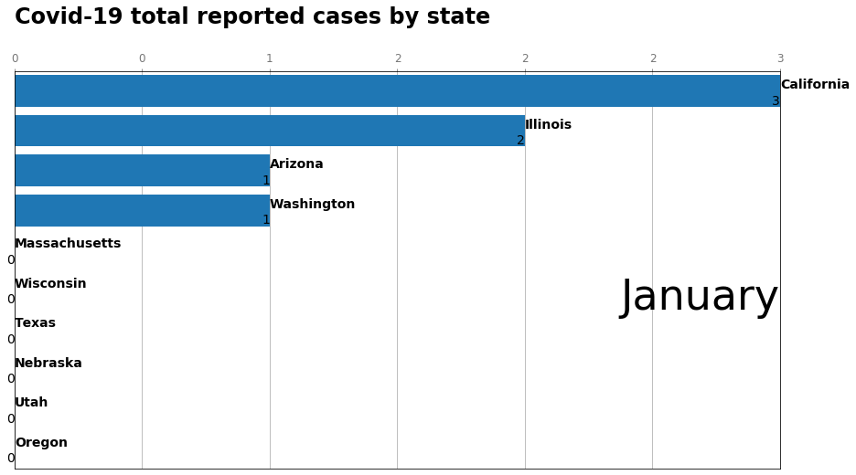
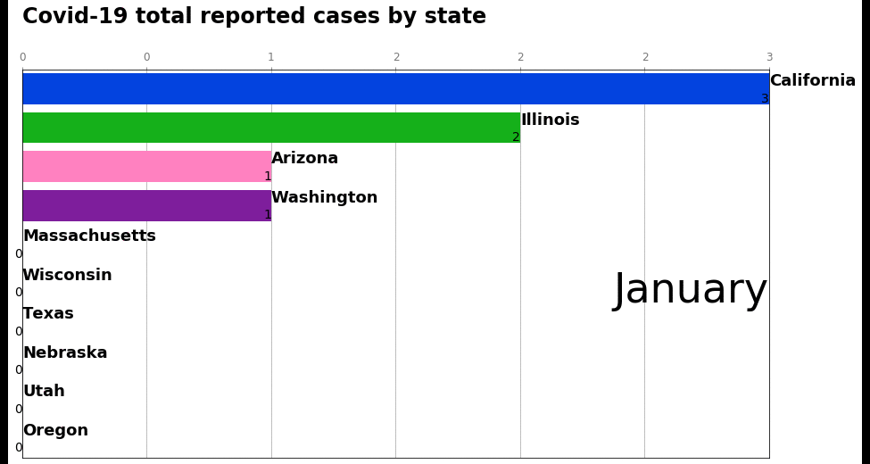
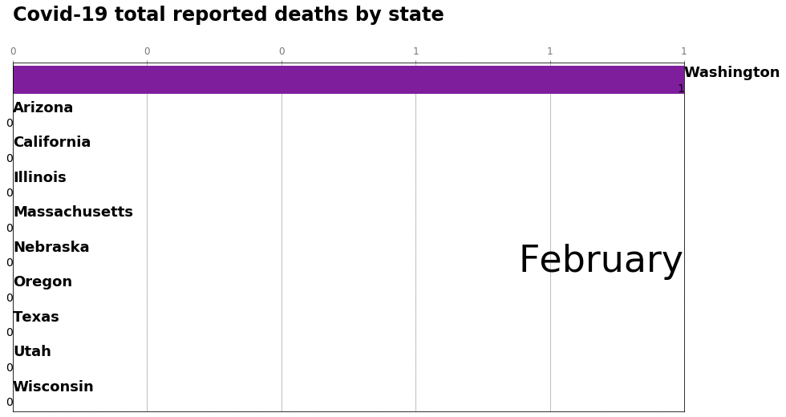

# **Bar Chart Race Covid-19**
## Aim of the Project:
 The purpose of this project was to create a bar chart animated gif file which would track the number of overall diagnosed cases of Covid-19 for each state.
 The dataset was pulled off of Kaggle. The output is a series of bar charts, each bar chart containing the top 10 states with the highest confirmed cases of Covid-19 diagnoses.
 Data collection starts on the 31st of January and goes weekly until the 3rd of July.
 
 ## Method:
 Pandas is used to collect the data from the csv file, and used for storage.
 
 The function get_week() is used to collect and clean the data from the dataset provided.
 The function get_plot() is used to design the bar charts for each week.
 
 **e.g.**

 
 A simple for loop goes through each week and produces a bar chart image which can be saved and stitched together to create the gif.
 
 
 
 

